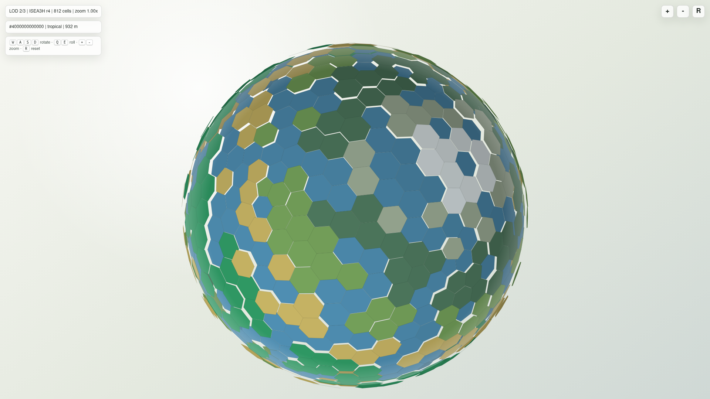
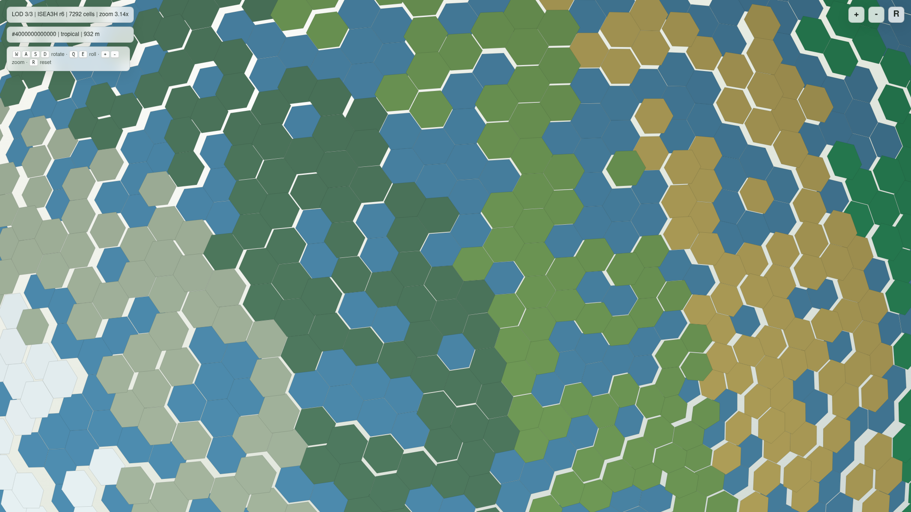
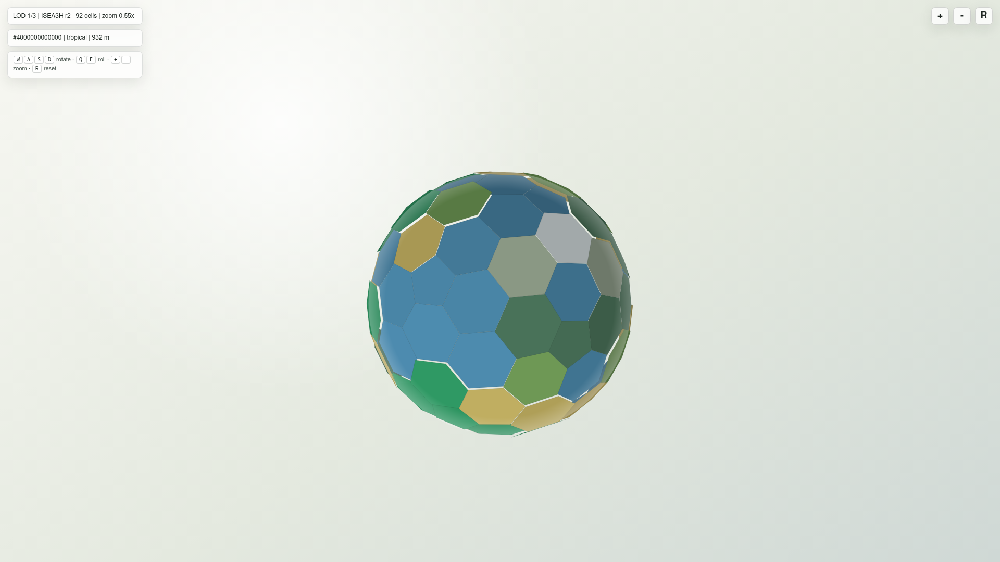

# Версия 0.0.3: WASD-управление, LOD и заметки про текстуры и 3D-объекты

Issue #9 ставит три задачи:

- сделать вращение сферы удобным через клавиатуру (W A S D);
- увеличить число ячеек, потому что 812 — слишком мало для планеты,
  и переключать прорисовку при приближении/отдалении, чтобы не
  превышать ресурсы клиента;
- зафиксировать в маркдауне соображения о текстурах и о том, как в
  будущих версиях рисовать на ячейках объёмные здания.

## WASD и поведение камеры

Файл `game1/hex_sphere_viewer.py` теперь обрабатывает клавиатуру в
просмотрщике:

- `W` / `S` наклоняют сферу вверх/вниз (питч),
- `A` / `D` вращают вокруг вертикальной оси (yaw),
- `Q` / `E` крутят вокруг оси взгляда (roll),
- `+` / `-` приближают и отдаляют, `R` сбрасывает камеру.

Логика держит набор активных клавиш и обновляется в
`requestAnimationFrame`. Шаг поворота нормирован на длительность кадра,
поэтому удержание клавиши даёт плавное движение даже на медленных
машинах. Мышь и сенсорные жесты по-прежнему работают: клавиатура их
дополняет, а не заменяет.

Поле `tabindex="0"` на `<canvas>` нужно, чтобы фокус приходил на холст
после клика. Без этого `keydown` приходил бы только на `window`, что
ломало бы взаимодействие, если страница встроена через iframe.

## LOD: больше ячеек и переключение по зуму

Раньше просмотрщик использовал один уровень разрешения ISEA3H и поэтому
отрисовывал ровно 812 ячеек (`resolution=4`). Это слишком мало для
планеты с гексами около 10 метров, но и нельзя нарисовать миллиарды
ячеек одновременно.

Решение — иерархия LOD. Функция
`game1.hex_sphere.build_hex_sphere_lod_payload()` строит несколько
мешей одновременно (по умолчанию `resolution=2, 4, 6`, то есть
`92 → 812 → 7292` ячеек) и упаковывает их в один payload. Просмотрщик
держит все уровни в памяти и каждый кадр выбирает нужный по текущему
зуму:

| LOD | Resolution | Cells |
|-----|------------|-------|
| 1   | 2          | 92    |
| 2   | 4          | 812   |
| 3   | 6          | 7 292 |

Пороги переключения хранятся в `payload.zoomThresholds`. По умолчанию
LOD растёт каждый раз, когда зум превышает 1.0 и затем 1.6. Зум
ограничен диапазоном `[0.55, 6.0]`, поэтому при максимальном
приближении планета явно меняет геометрию. Чтобы убедиться визуально,
надпись в HUD показывает текущий уровень и количество ячеек.

Архитектура соответствует более «правильной» логике: на сервере живёт
ISEA3H-сетка с миллиардами логических ячеек, а на клиенте — только
несколько сжатых мешей. В будущей версии вместо «трёх предсчитанных
LOD» сюда впишется streaming чанков из issue #7: камера попадает в
определённый face-чанк, клиент подгружает его в высоком разрешении, а
далёкие чанки оставляет на грубом LOD. Текущая `CellSpatialIndex` уже
готовит этот переход.

При желании можно перегенерировать просмотрщик с другими уровнями
детализации:

```bash
python examples/run_hex_sphere_viewer.py --resolutions 2,4,6
python examples/run_hex_sphere_viewer.py --resolutions 4,6
python examples/run_hex_sphere_viewer.py --resolution 4   # совместимость
```

Уровни должны быть чётными — это требование точного dual-меша из
`render_frequency_for_resolution`. На уровне `r=8` получается 65 612
ячеек (~26 МБ JSON), что уже не помещается в один HTML, поэтому такие
LOD должны отдаваться отдельным запросом, а не вшиваться в файл.

## Текстуры на canvas и объёмные здания: как это видится дальше

Краткий ответ: да, на `<canvas>` можно рисовать и текстуры, и 3D, но
2D-канва, которая используется сейчас, для объёмных зданий уже не
подходит. Долгосрочно стоит переходить на WebGL/WebGPU.

### Что умеет текущий 2D-canvas

- Закрашивать полигоны цветом биома (это уже сделано).
- Заливать полигон растровой картинкой через
  `CanvasPattern` или `drawImage` с трансформацией. Для плоских
  текстур, наклеенных на гекс, этого достаточно.
- Рисовать на гексе спрайт здания как 2D-картинку с псевдо-3D в духе
  Timberborn-обзора сверху. Получится красиво, но без настоящего
  объёма: спрайт всегда смотрит «прямо», и если игрок повернёт сферу,
  сгладить искажения не выйдет.

Поэтому 2D-canvas — нормальный выбор для версии 0.0.x, когда нужно
быстро показать биомы, реки и метки клеток без зависимостей. Но
объёмные здания с тенями, светом, разными ракурсами требуют
возможностей графического API.

### Куда расти: WebGL/WebGPU и Three.js

Естественный следующий шаг — заменить 2D-канву на WebGL (через
[Three.js](https://threejs.org/) или [Babylon.js](https://www.babylonjs.com/))
или WebGPU. Тогда:

1. **Сфера превращается в настоящий 3D-меш.** Вершины уже считаются в
   `build_hex_sphere_mesh`, а `boundary` каждой клетки готова к
   индексу OpenGL. Достаточно один раз отдать буферы вершин и индексов.
2. **Текстуры приходят из атласа биомов.** Каждой клетке выдаётся
   `uv` по форме гекса (или пентагона для 12 особых клеток), а
   фрагментный шейдер выбирает спрайт «лес», «степь», «океан» из
   общего PNG-атласа. Биом и высота уже есть в payload, поэтому это не
   требует больших данных по сети.
3. **Объёмные здания — отдельный слой instanced-моделей.** Здание не
   кладётся «на текстуру». В шейдере создаётся `instanceMatrix` для
   каждой клетки с постройкой: перенос в центр клетки, поворот по
   нормали к сфере, масштаб по высоте здания. Один draw call рисует
   тысячи коробок, ангаров, ветрогенераторов. Это стандартная схема
   для стратегий с большим числом одинаковых объектов.
4. **LOD моделей.** У зданий есть свои LOD-уровни: издалека куб с
   плоской текстурой, на средней дистанции — модель с крышей, при
   ближнем зуме — детализированная сцена с анимациями работников.
   Те же `zoomThresholds`, что выбирают LOD сферы, можно переиспользовать
   для подмены моделей.
5. **Тени и свет.** В WebGL легко получить направленный свет
   (солнце), точечные источники (фонари), shadow map. На 2D-canvas
   это пришлось бы рисовать заранее в спрайте.

### Промежуточный путь без полного 3D

Если переход на WebGL хочется отложить, можно эволюционно:

- На текущем canvas рисовать здания как изометрические спрайты, выбирая
  ракурс по углу между клеткой и камерой (8 направлений хватит).
- Заранее запечь текстуры биомов в маленький атлас и накладывать на
  гексы через `CanvasRenderingContext2D.setTransform` + `drawImage`.
  Это уже даст эффект текстур без перехода в WebGL.
- Подсветку держать через текущее `shadeColor` от направления света,
  как сейчас.

Этот «грязный 3D через 2D» масштабируется хуже (нет тысяч моделей),
но даёт нужный визуальный апгрейд для нескольких ранних версий.

### Связь с серверной моделью и ресурсами

Игре нужно будет передавать не только биом и высоту, но и состояние
постройки: тип здания, фаза строительства, занятые жители, остановлено
оно или работает. Это уже соответствует `CellEvent` из issue #7 —
каждое событие «построить, остановить, запустить» ссылается на id
клетки, а клиент держит локальный кэш зданий по id. Графический LOD
никак не должен влиять на эти данные: даже когда клетка не
отрисовывается на этом уровне детализации, событие всё равно меняет
состояние модели.

Память клиента ограничена, поэтому здания тоже стоит держать в
чанках. Например, в радиусе 2 чанков от камеры — полный 3D, дальше —
плоские иконки или агрегированные «здесь n зданий». В перспективе
это ещё одна причина не привязывать рисование 3D к 2D-canvas:
streaming тысяч кубов и моделей быстро упрётся в производительность.

## Что осталось за рамками 0.0.3

- Настоящий WebGL/WebGPU-рендер. Подготовлены данные (вершины,
  биомы, высоты), но переход на 3D-движок — отдельный большой шаг.
- Streaming чанков по зуму. Текущий LOD предсчитан целиком; в будущем
  его заменит подгрузка чанков по событиям камеры.
- Реальные текстуры биомов и модели зданий. Для них нужен арт-пайплайн,
  который мы пока не запускаем.
- Контроллер геймпада и сенсорные жесты «двумя пальцами»: WASD и
  колесо/кнопки покрывают клавиатуру и мышь, остальное добавим позже.

## Проверка

```bash
python -m unittest discover -s tests -v
python examples/run_hex_sphere_viewer.py
python -m compileall resource_based_economy_strategy game1 examples tests
```

Открытый `examples/hex_sphere_viewer.html` управляется WASDQE,
переключает LOD при изменении зума и показывает текущий уровень и
количество ячеек в HUD.

## Скриншоты

Запуск просмотрщика на разных уровнях зума:

- LOD 2 при зуме `1.00x` — 812 ячеек, обычный обзор:
  
- LOD 3 при зуме `~3x` — 7292 ячейки, ближний LOD:
  
- LOD 1 при зуме `0.55x` — 92 ячейки, дальний LOD:
  
