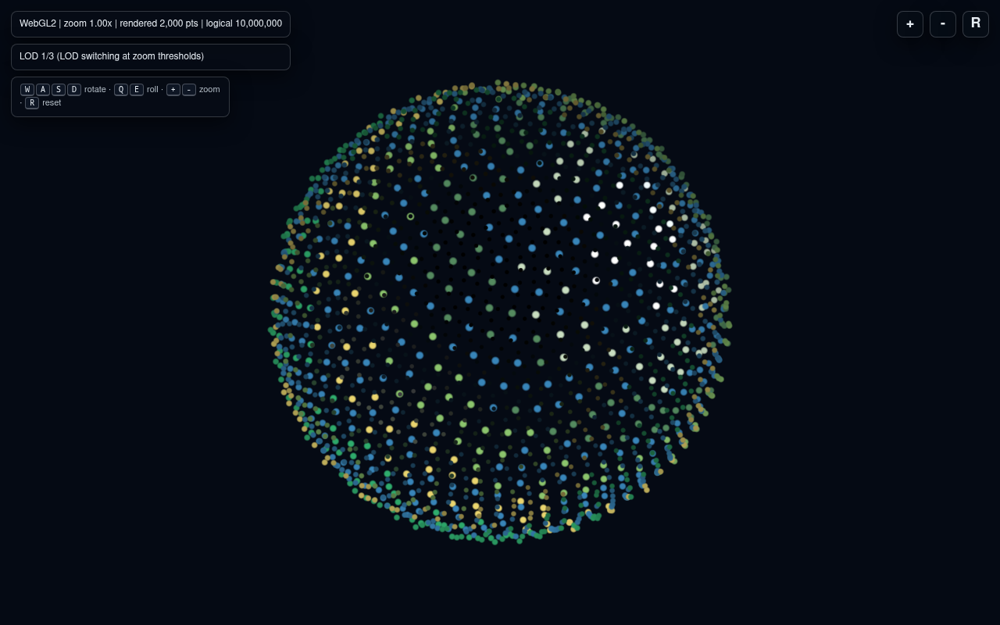
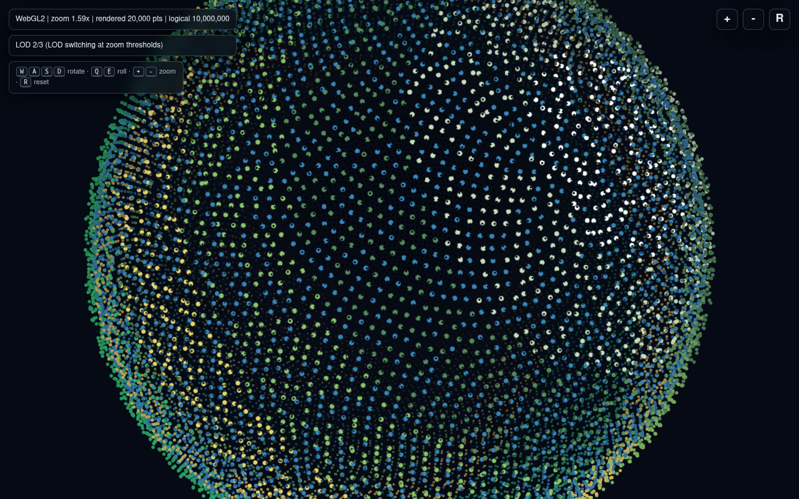
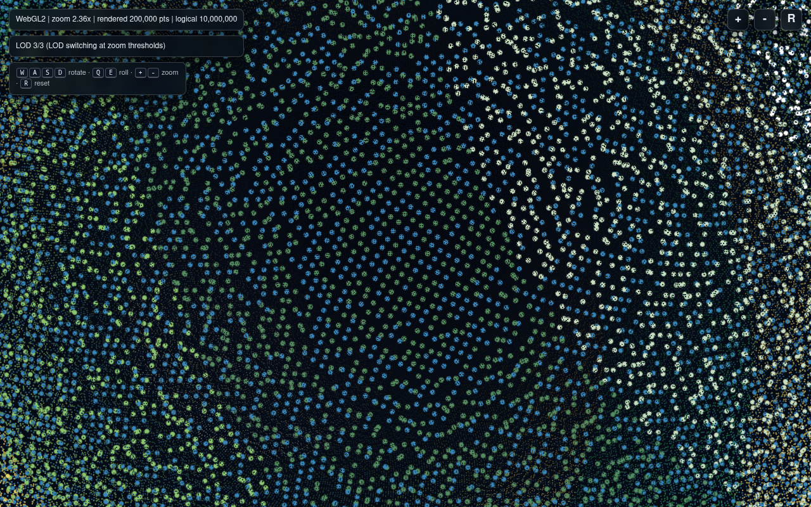

# Версия 0.0.4: 3D-рендер на WebGL и сферическое облако точек

Issue #11 ставит четыре пересекающиеся задачи:

- отказаться от 2D-канвы и перейти к настоящему 3D;
- получить разрешение в миллионы «ячеек/точек», расположенных в
  сферических координатах, чтобы к каждой можно было позже привязать
  3D-модель здания или подвижного транспорта, прорисовываемую только на
  определённом зуме;
- зафиксировать в маркдауне, почему мы не уходим в Unity и стоит ли
  предпочесть WebGL или WebGPU;
- ответить, насколько вэб-клиент в принципе годится для игры с большим
  числом действующих и подвижных элементов.

Версия 0.0.4 решает первые две задачи кодом и закрывает остальные две
этим документом.

## От полигонов к точкам

В версии 0.0.3 мы строили полноценный полигональный гекс-меш через
`game1.hex_sphere.build_hex_sphere_mesh`. Это работает до уровня
ISEA3H `r=6` (7 292 ячейки), а уже на `r=8` (65 612 ячеек) JSON
перестаёт помещаться в один HTML. Чтобы получить миллионы клеток без
триангуляции, версия 0.0.4 добавляет отдельный модуль
`game1.sphere_points`, который сэмплирует точки на единичной сфере
**Фибоначчиевой решёткой** (золотой угол `π·(3 − √5)`):

```python
z = 1.0 - (2*i + 1) / count
radius_xy = sqrt(1 - z*z)
theta = golden_angle * i
x = cos(theta) * radius_xy
y = sin(theta) * radius_xy
```

Это даёт почти равномерное покрытие сферы без какой-либо дополнительной
структуры данных и без явных швов. Каждая точка описывается только
четырьмя полями:

- `position` — вектор единичной сферы (`f32 × 3`);
- `biome` — индекс из палитры (`u8` хватает на до 256 биомов);
- `elevation` — высота в метрах (`i16`);
- неявный `id` — индекс точки в массиве, по которому к ней можно будет
  позже подвязать постройку или транспорт.

Биом и высота не хранятся как «данные на сервере», а воспроизводимо
выводятся из позиции и зерна:

```python
def _biome_and_elevation(point, latitude, salt):
    base_noise = _noise(point, salt)
    if base_noise < 0.42:
        return "ocean", int(round(-200 + base_noise * 400))
    return _biome_for_latitude(latitude), int(round(_noise(...) * 2200))
```

Поэтому payload даже на 200 000 точек не хранит на каждую точку
ничего тяжёлого — массивы параллельные и ложатся в один GPU-буфер.

### Multi-LOD payload и 10 000 000 логических точек

Issue говорит про «миллионы ячеек», но миллион точек по 16 байт
выходит ≈ 16 МБ — для встроенного в HTML payload это уже много.
Поэтому `build_sphere_point_payload` возвращает не один уровень, а
ладдер LOD, как в 0.0.3:

| LOD | Точек     | Назначение                            |
|-----|-----------|---------------------------------------|
| 1   | 2 000     | дальний обзор планеты («с орбиты»)    |
| 2   | 20 000    | средний приближённый обзор            |
| 3   | 200 000   | ближний обзор отдельного континента   |

При этом `target_logical_count = 10 000 000` фиксирует, что логически
сервер адресует десять миллионов точек: нынешние LOD — это
детерминированные подвыборки той же фибоначчиевой решётки, и id точек
любого уровня совпадает с её номером в общем массиве. Это та же
архитектура, что и у 0.0.3: на сервере живёт сетка большого размера, а
клиент держит один LOD.

```bash
python examples/run_webgl_planet_viewer.py
python examples/run_webgl_planet_viewer.py --counts 4000,40000,400000
python examples/run_webgl_planet_viewer.py --target-logical-count 50000000
```

Пороги переключения хранятся в `payload.zoomThresholds`; по умолчанию
LOD 2 включается на зуме `1.4x`, LOD 3 — на `2.3x`.

## Почему отказались от полигонов канваса

После 0.0.3 идея «плоский полигон на 2D-канве + спрайт здания сверху»
дальше не растёт:

- 2D-канва не даёт настоящих ракурсов: при повороте сферы здания
  смотрят боком и выглядят как наклеенные стикеры.
- Полигональный меш нужно перестраивать каждый раз, когда меняется
  разрешение. Даже LOD-ладдер с тремя уровнями уже неудобно встраивать
  в один файл.
- Всё, что нужно от ячейки на больших зумах, — это «есть ли тут что
  показать»: домик, вышка, грузовик. Точка с id справляется с этим
  лучше полигона.

Поэтому 0.0.4 не строит полигоны на клиенте вообще: WebGL рисует точки
билбордами (`gl.POINTS`, дискард по `gl_PointCoord`) с диффузной
полусферой по нормали `aPosition`. Биом превращается в цвет в шейдере
по `switch`, высота даёт лёгкую радиальную деформацию для рельефа.
Никакой триангуляции на клиенте нет.

## WebGL2 (а не Unity, и пока не WebGPU)

### Почему не Unity

Unity — это полноценный игровой движок, привлекательный своими
встроенными физикой, светом и редактором. Но для нашей задачи он не
подходит сразу по нескольким причинам.

1. **Распространение и порог входа.** Игре нужен мгновенный запуск:
   зашёл по ссылке, увидел сферу. WebGL-сборка Unity тяжёлая (мегабайты
   рантайма), холодный старт у неё измеряется секундами, а нативный
   билд требует установки приложения. Версия 0.0.x живёт как набор
   `python` + статический HTML; добавление Unity сразу означает другой
   тулчейн, отдельные билды и CI.
2. **Соответствие архитектуре.** Игра идёт по принципу «сервер хранит
   состояние клеток, клиент рисует визуализацию». Серверная часть на
   стандартной библиотеке Python, без зависимостей. Втащить Unity ради
   рендера — это разделить мир на две несинхронизированные модели,
   которые придётся склеивать через сетевой протокол. WebGL держит
   рендер в той же странице, что и UI.
3. **Производительность для нашего сценария.** У нас не «AAA-3D с
   физикой и анимацией». У нас миллион билбордов и время от времени
   instanced модели зданий. WebGL2 справляется с этим напрямую, без
   пересборки кадра через CPU.
4. **Контроль над данными.** Точки и LOD — наш домен. Unity заставит
   передавать их через свои `Mesh`, `ScriptableObject`, ассет-пайплайн.
   Текущий сценарий — один JSON-payload, упакованный в HTML, — этому
   не друг.

Unity можно подключить позже как **отдельный** клиент (как делают
многие веб-проекты), но не как замену вэбу.

### WebGL2 vs WebGPU

WebGPU — это будущее, но 0.0.4 остаётся на WebGL2 сознательно.

| Критерий               | WebGL2                            | WebGPU                                |
|------------------------|-----------------------------------|---------------------------------------|
| Поддержка браузеров    | Все актуальные, включая Safari    | Chrome/Edge/Firefox в последних версиях, Safari 17+ |
| Инструменты            | Зрелые, много примеров            | Документация ещё формируется          |
| Шейдерный язык         | GLSL ES 3.00                      | WGSL                                  |
| Compute shaders        | Нет                               | Есть                                  |
| Modern bindless/indirect | Ограниченно                     | Полноценно                            |
| Подходит ли для 0.0.4? | Да: только VBO + draw points      | Избыточно                             |

Для нашего нынешнего рендера — «один draw call на LOD, миллион
позиций, простой фрагментный шейдер» — WebGL2 хватает с большим
запасом. WebGPU начнёт оправдывать себя, когда:

- появится compute-шейдер, симулирующий движение транспорта прямо на
  GPU между кадрами;
- понадобится bindless-доступ к атласу из тысяч уникальных моделей
  зданий;
- симуляция начнёт читать состояние GPU обратно (например, для
  профайлинга движущихся юнитов в видимом фрустуме).

В 0.0.4 ничего из этого нет, поэтому переход на WebGPU отложен. Когда
соберётся хотя бы два пункта из списка выше, перенос будет
поверхностным: шейдеры конвертируются в WGSL, а рендерер в JS почти
не меняется — обе API оперируют буферами и пайплайнами.

## Веб-клиент и масштаб игры

> «В будущих версиях на межгороднем зуме точками должны будут
> отображаться перемещающийся транспорт. Мы точно должны использовать
> вэб-клиент для игры? Всё таки много будет действующих и подвижных
> элементов».

Короткий ответ: **да, веб-клиент годится**, и вот почему.

1. **Ограничение клиента — это окно отрисовки, а не общий мир.**
   Сервер может хранить миллионы клеток и тысячи юнитов, но клиент
   видит только то, что попадает в текущий LOD и фрустум. Это уже
   делается в 0.0.4: 200 000 точек рисуются за один draw call,
   остальные просто не загружаются. Транспорт ляжет в ту же схему —
   instanced буфер в пределах видимой области.
2. **Действующие и подвижные элементы дешевле, чем кажется.** Тысячи
   движущихся точек — это типовая задача WebGL: каждая точка — пара
   `position` + `velocity`, кадр обновляется на CPU/GPU и снова
   рисуется одним draw call. Разница с «100 действующими элементами»
   только в размере буфера, а не в типе кода.
3. **Сервер берёт на себя авторитетные расчёты.** Передвижение
   транспорта, обновление производства, расход ресурсов считаются на
   сервере; клиент только интерполирует между состояниями. Это снимает
   с веб-страницы основную нагрузку: ей нужен рендер, а не
   физическая модель.
4. **Распределённость и обновление.** Веб-клиент даёт мгновенные
   обновления, кросс-платформенность (PC, телефон, планшет), запуск из
   любого браузера и встроенную песочницу безопасности. Native-клиент
   таких преимуществ не даёт, а проигрывает по простоте развёртывания.

Когда вэб действительно станет узким местом, диагностика покажет это
явно: упадёт fps на профайлинге, начнёт расти GC, появятся пропуски
кадров на CPU. До этого момента смысла менять стек нет.

## Здания и города на следующем зуме

Issue прямо говорит: **LOD-моделей зданий пока делать не надо**. У
зданий достаточно одного состояния «видны / не видны»:

- городской зум показывает порядка ста зданий за раз — instanced
  3D-модели, привязанные к id точки;
- межгородний зум прячет здания и показывает города как точки с
  соединительными линиями (дорогами).

Версия 0.0.4 готовит для этого данные, но не рисует их:

- Каждая точка адресуема по индексу, что и есть «id» для будущего
  здания/транспорта.
- Высота `aElevation` уже учитывается в шейдере — здание встанет на ту
  же высоту, что и базовая точка.
- Зум-пороги переиспользуют ту же модель из 0.0.3: добавится ещё один
  порог, выше которого включается отдельный draw call instanced
  моделей.

То есть «городской и межгородний зум» в 0.0.4 — это **один и тот же
точечный рендер на разных уровнях LOD**, а добавление зданий и
транспорта в будущей версии не потребует пересмотра данных, только
дополнительный шейдер.

## Что осталось за рамками 0.0.4

- Реальные 3D-модели зданий и транспорта (instanced рендер).
- Streaming чанков точек по событиям камеры (сейчас весь LOD-payload
  встраивается в HTML целиком).
- Compute-симуляция движения юнитов на GPU (ждёт перехода на WebGPU).
- Тени и атмосферное рассеяние; текущий шейдер ограничен диффузной
  полусферой.

## Проверка

```bash
python -m unittest discover -s tests -v
python examples/run_webgl_planet_viewer.py
python -m compileall resource_based_economy_strategy game1 examples tests
```

Файл `examples/webgl_planet_viewer.html` — самодостаточный HTML:
WebGL2-контекст инициализируется без CDN, HUD показывает текущий зум,
номер LOD и количество отрисованных точек, управление совпадает с
0.0.3 (`WASD` для вращения, `QE` для крена, `+/-` для зума, `R` для
сброса).

## Скриншоты

Просмотрщик на разных уровнях зума (10 000 000 логических точек,
2 000 / 20 000 / 200 000 в LOD-ладдере):

- LOD 1/3 при зуме `1.00x` — 2 000 точек, орбитальный обзор:
  
- LOD 2/3 при зуме `~1.6x` — 20 000 точек, средний обзор:
  
- LOD 3/3 при зуме `~2.4x` — 200 000 точек, ближний обзор поверхности:
  
