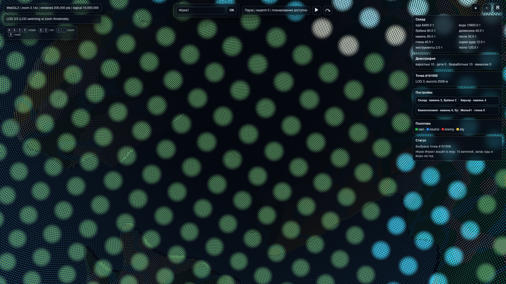

# Версия 0.0.5: биомы, недельное время и первый игровой слой

Issue #13 переводит прототип от просмотрщика планеты к минимальной
игровой поверхности. Версия 0.0.5 не вводит сервер, но фиксирует
контракты, по которым следующий шаг сможет стать многопользовательским.

## Биомы и рельеф

`game1.sphere_points.sample_point_terrain()` заменяет точечный hash-noise
на непрерывный сферический шум. Поэтому ближайшие точки получают похожий
континентальный индекс, влажность и высоту, а биомы не рассыпаются
случайной мозаикой.

Генератор выдаёт:

- океаны и материки через низкочастотный `continent_score`;
- редкие острова как feature-флаг на океанских точках около уровня моря;
- горную местность через ridged-noise и отдельный флаг `FEATURE_MOUNTAIN`;
- озёра как влажные низины с флагом `FEATURE_LAKE`;
- реки как узкие непрерывные линии с флагом `FEATURE_RIVER` и перепадом
  высоты для будущей гидроэнергетики.

WebGL payload теперь содержит массив `features` рядом с `positions`,
`biomes` и `elevations`. Шейдер подкрашивает реки и озёра синим, горы
светлым рельефом, а базовый биом остаётся в палитре.

## Время

Старый `TimeController` сохранён: по умолчанию один день идёт за
10 секунд, чтобы не ломать тесты и примеры прошлых версий. Для новой
игровой петли добавлен `TimeController.weekly(...)`:

- `NORMAL`: 7 игровых дней каждые 5 секунд;
- `PAUSED`: симуляция не тикает, но планирование построек доступно;
- `FAST` и `SKIP`: старые быстрые/пропускные режимы остаются.

В статическом клиенте кнопка паузы управляет локальным недельным тиком,
а отдельная кнопка прокручивает одну неделю вручную для проверки.

## Игроки, люди и демография

`create_player_settlement(nickname)` создаёт старт версии 0.0.5:

- ник игрока сохраняется в `Settlement.player_nickname`;
- создаётся 10 индивидуальных жителей `Person` с именами `Чел1`,
  `Чел2`, ... и base32-id;
- стартовый склад получает еду и воду на 360 игровых дней для всех
  10 жителей;
- дети до 16 лет не входят в `daily_labor_capacity`;
- `Settlement.demographics()` возвращает взрослых, детей, безработных
  и вакансии;
- `status_events` хранит взросление, рождения, смерти и планирование
  построек.

Агрегированная модель `Settlement(people=...)` из 0.0.1-0.0.4
продолжает работать: индивидуальные граждане включаются только когда
передан список `citizens`.

## Постройки и склад

Ресурсы по-прежнему без денег и измеряются тоннами. В `DEFAULT_BUILDINGS`
добавлена первая цепочка:

- `warehouse` — склад;
- `quarry` — открытая добыча камня, песка и глины;
- `stone_quarry` — каменоломня, после неё доступно `lumberjack_site`;
- `lumberjack_site` — добывает брёвна;
- `housing1` ... `housing5` — жильё от 5 до 5000 мест;
- `brick_factory` — глина → кирпич;
- `forge` — сырая руда + брёвна → инструменты;
- `sawmill` — брёвна → доски;
- `foundry` — сырая руда → металл.

`Settlement.available_building_names()` считает меню построек по активным
зданиям, а `plan_building(name, point_id=...)` списывает ресурсы,
добавляет постройку и пишет событие. Это работает и на паузе, потому
что планирование не зависит от тика времени.

## Политический слой

Для будущего мультиплеера введён стабильный словарь цветов:

| Отношение | Цвет |
|-----------|------|
| собственные | зелёный `#2fb344` |
| нейтральные | синий `#2f80ed` |
| враги | красный `#d63031` |
| союзники | жёлтый `#f2c94c` |

Пока это локальная функция `policy_color(...)` и легенда в WebGL-клиенте;
позже тот же ключ будет приходить с сервера для зданий, городов и юнитов.

## Интерфейс WebGL

`examples/webgl_planet_viewer.html` остаётся самодостаточным HTML без CDN,
но теперь поверх планеты есть игровой HUD:

- поле ника и вход;
- кнопка паузы и ручной недельный шаг;
- склад с ресурсами в тоннах;
- демография: взрослые, дети, безработные, вакансии;
- статусная строка событий;
- выбор точки только на максимальном LOD;
- меню доступных построек после выбора точки.

Выбор точки не меняет данные LOD: он берёт ближайшую видимую точку из
активного максимального уровня и использует её индекс как будущий id
клетки для серверных событий.

## Проверка

```bash
python -m unittest discover -s tests -v
python -m compileall resource_based_economy_strategy game1 examples tests
python examples/run_webgl_planet_viewer.py
```

Дополнительно WebGL-клиент проверяется в браузере: canvas не пустой,
кнопки зума работают, UI рендерится, и выбор точки становится доступен
на максимальном LOD.

## Скриншот

LOD 3 с выбранной точкой, складом, демографией, политическим слоем и
меню построек:


