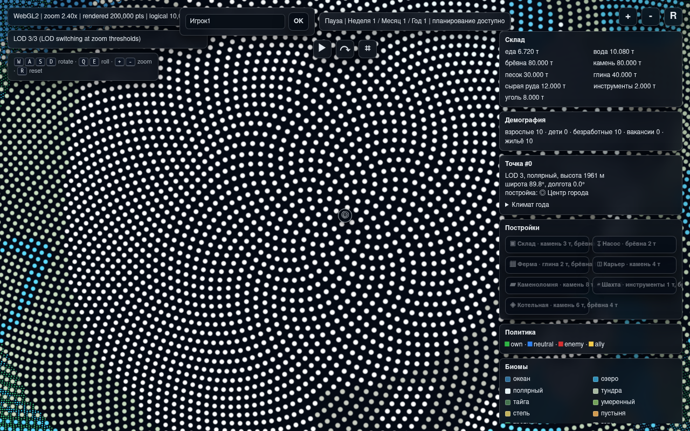

# Версия 0.0.6: центр города, ресурсы и слои карты

Issue #15 уточняет первый игровой прототип после версии 0.0.5. Цель версии
0.0.6 — убрать условные заглушки из старта поселения, привести единицы
потребления к разумным игровым масштабам и сделать WebGL-карту пригодной
для выбора точек под постройки.

## Календарь

Время по-прежнему тикает днями в Python-ядре и неделями в WebGL-клиенте,
но интерфейс показывает календарную подпись:

- 1 неделя = 7 дней;
- 1 месяц = 4 недели;
- 1 год = 12 месяцев = 336 дней;
- подпись имеет вид `Неделя N / Месяц N / Год N`.

`TimeController.skip_months()` и `skip_years()` используют те же 28- и
336-дневные периоды, чтобы быстрые пропуски совпадали с UI.

## Старт поселения

`create_player_settlement(nickname)` создаёт старт версии 0.0.6:

- первое здание — `city_center`;
- центр города бесплатный, уникальный и принадлежит игроку;
- на точке может стоять только одно здание;
- сброс камеры в WebGL возвращает фокус к центру города;
- игровой слой не стартует с набором производственных построек.

Центр города даёт первое жильё, склад и точку привязки для следующих
построек. Это делает старт пригодным для будущего серверного события
`игрок основал город в #<point_id>`.

## Ресурсы и потребности

Ресурс `wood` удалён из стартовых запасов и производственных рецептов.
Древесина в цепочках представлена `roundwood`, а тепло заменено
энергией `energy_mw_day`:

- еда: `0.002` тонны на человека в день;
- вода: `0.003` тонны на человека в день;
- энергия: `МВт·сут`, сейчас нужна только в холоде;
- брёвна и уголь могут производить энергию в котельной.

Если воды или еды не хватает, потребление распределяется по людям
последовательно. Все, до кого ресурс не дошёл в этот день, погибают в
одном тике с причиной `жажды`, `голода` или `холода`.

## Постройки

Новые и уточнённые постройки:

- `pump` добывает воду и строится за брёвна после центра города;
- `farm` производит еду после центра города;
- `brick_factory` перерабатывает глину в кирпич;
- `mine` добывает сырую руду, стоит инструменты и брёвна, доступна только
  на горных точках;
- `boiler_house` переводит брёвна или уголь в `energy_mw_day`.

`Settlement.plan_building(...)` теперь принимает биом и feature-флаги
точки, проверяет ограничения здания и запрещает вторую постройку на том
же `point_id`.

## Демография

Рождения завязаны на жильё и взрослых жителей. Каждая пара взрослых может
создать одного ребёнка за восемь месяцев, то есть за `224` игровых дня.
Если свободного жилья нет, накопленный прогресс рождения не создаёт новых
жителей.

## WebGL-карта

Статический клиент версии 0.0.6 добавляет:

- ограничение максимального зума у поверхности планеты;
- отсечение точек на обратной стороне сферы;
- слой меридианов и параллелей с отдельной кнопкой;
- легенду цветов биомов;
- иконки построек над видимыми точками;
- фокус камеры на выбранной точке и сброс к центру города;
- подробности выбранной точки: id, биом, широта/долгота, годовой климат,
  текущая постройка и доступность новых построек.

Шейдер получает матрицу вида, поэтому клиент может отличать ближнюю и
дальнюю стороны планеты без отдельной серверной подготовки.

## Проверка

```bash
python -m unittest tests.test_version_006_gameplay -v
python -m unittest discover -s tests -v
python -m compileall resource_based_economy_strategy game1 examples tests
python examples/run_webgl_planet_viewer.py
```

## Скриншот

WebGL-клиент с центром города, легендой биомов, календарём, ресурсами и
слоем меридианов/параллелей:


