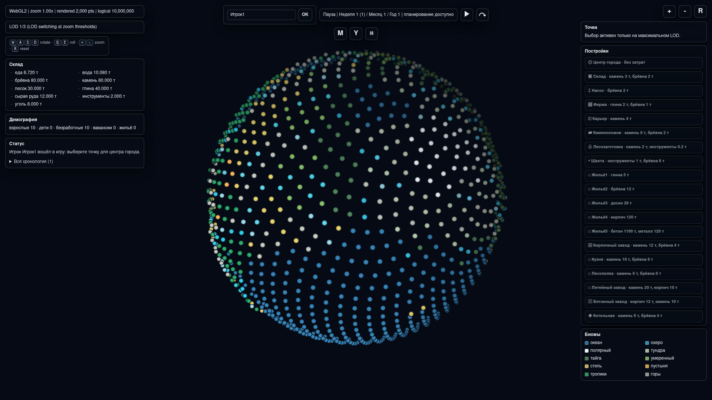
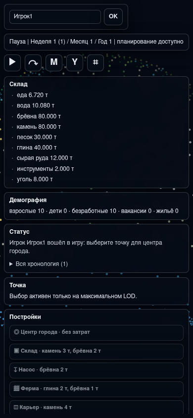

# Версия 0.0.7: выбор центра, работники и пропуск времени

Issue #17 собирает доработки первого WebGL-игрового слоя после версии 0.0.6.
Цель версии 0.0.7 — сделать старт города осознанным выбором игрока и убрать
ошибки, из-за которых карта, постройки и демография вели себя не как
ресурсная стратегия.

## Старт и строительство

WebGL-клиент больше не ставит `city_center` в точку `0` автоматически.
Игрок сначала выбирает точку на максимальном LOD и ставит центр города как
обычную постройку. Пока активного центра нет, остальные постройки остаются
недоступными и по клику показывают причину.

`Settlement.plan_building(...)` поддерживает тот же сценарий на уровне ядра:
точка не может принять вторую постройку, океанский биом запрещён для любых
зданий, а уникальная постройка не дублируется, пока не снесена.

Выбранная точка подсвечивается отдельным маркером. Планирование постройки
больше не вызывает фокус камеры на эту же точку, поэтому карта не
смещается после клика по кнопке строительства.

## Постройки и работники

Постройки получили явное состояние активности:

- активная постройка учитывает вакансии и может производить;
- выключенная постройка не занимает работников и не даёт ресурсы;
- постройку можно снести, освободив точку;
- у обработанной за тик постройки сохраняются имена назначенных работников.

Ядро назначает каждого взрослого работника только один раз за тик. Если
работника не хватает, постройка не производит и не перерабатывает ресурсы.

Добавлен `concrete_factory`: для строительства нужны кирпичи и камень, а
рабочий рецепт перерабатывает песок и сырую руду в бетон. Кузня в WebGL
слое теперь перерабатывает сырую руду и брёвна в инструменты.

## Демография

Дети потребляют еду и воду с коэффициентом `0.5` от взрослого. Недостаток
еды или воды может убить и ребёнка, поэтому дети больше не являются
бессмертной группой населения.

Возраст жителей по-прежнему считается в днях в Python-ядре и в неделях в
WebGL-клиенте. При достижении 16 лет статус пишет, что житель взрослеет.
При рождении в журнал попадает имя нового ребёнка, например `Чел11 родился`.

## Интерфейс

Статус и демография перенесены в левый верхний HUD рядом со складом.
Легенда политики убрана из WebGL-клиента. Журнал показывает последние
события и раскрываемую полную хронологию.

Склад показывает стрелку тенденции по каждому видимому ресурсу:

- `↑` — ресурс вырос за последний недельный тик;
- `↓` — ресурс уменьшился;
- `·` — заметного изменения нет.

Кнопки `M` и `Y` пропускают месяц и год. Перед пропуском клиент оценивает
риск нехватки еды или воды и просит подтвердить действие, если запасов может
не хватить.

Календарь показывает номер недели внутри месяца и абсолютный номер недели в
скобках: `Неделя 1 (49) / Месяц 1 / Год 2`.

## Управление камерой

Чувствительность мыши снижена через отдельный `POINTER_ROTATE_STEP`.
Ограничение угла тангажа снято, а углы нормализуются по полному обороту, так
что планету можно свободно вращать в любую сторону без упора.

## Проверка

```bash
python -m unittest tests.test_version_007_gameplay -v
python -m unittest discover -s tests -v
python -m compileall resource_based_economy_strategy game1 examples tests
python examples/run_webgl_planet_viewer.py
```

## Скриншоты

Desktop:



Mobile:


